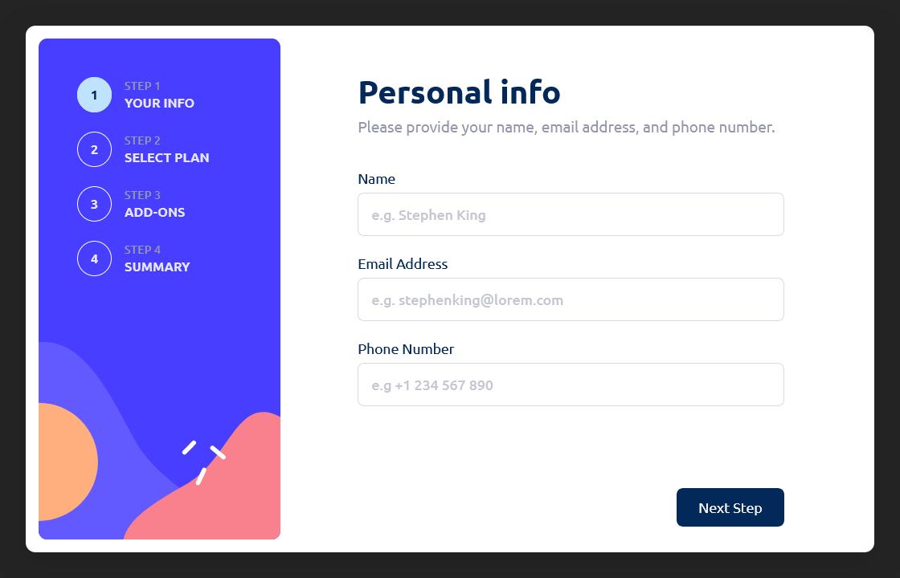

# Frontend Mentor - Multi-step form solution

This is a solution to the [Multi-step form challenge on Frontend Mentor](https://www.frontendmentor.io/challenges/multistep-form-YVAnSdqQBJ). Frontend Mentor challenges help you improve your coding skills by building realistic projects. 

## Table of contents

- [Overview](#overview)
  - [The challenge](#the-challenge)
  - [Screenshot](#screenshot)
  - [Links](#links)
- [My process](#my-process)
  - [Built with](#built-with)
  - [Redux Store Slices](#redux-store-slices)
  - [Project goals](#project-goals)
  - [Useful resources](#useful-resources)
- [Author](#author)

## Overview

### The challenge

Users should be able to:

- Complete each step of the sequence
- Go back to a previous step to update their selections
- See a summary of their selections on the final step and confirm their order
- View the optimal layout for the interface depending on their device's screen size
- See hover and focus states for all interactive elements on the page
- Receive form validation messages if:
  - A field has been missed
  - The email address is not formatted correctly
  - A step is submitted, but no selection has been made

### Screenshot



### Links

- Solution URL: [Add solution URL here](https://your-solution-url.com)
- Live Site URL: [Add live site URL here](https://your-live-site-url.com)

## My process

### Built with

- Semantic HTML5 markup
- CSS3, CSS Grid, Flexbox
- [React](https://reactjs.org/) - Javascript library
- [Redux](https://redux.js.org/) - React state management tool
- [Sass](https://sass-lang.com/) - CSS preprocessor

### Redux Store Slices

- The Redux store slices are defined as follows:
```
{
  stepsProgress?: {
    userInfo: false,
    selectPlan: false,
    selectAddons: false,
    summary: false,
  },
  user: {
    name: '',
    email: '',
    phone: '',
  },
  plan: {
    subscriptionType: '',
    subscriptionPrice: '',
    subscriptionRenewalInterval: '',
    subscriptionRenewalIntervalUnit: '', (Monthly || Yearly)
  },
  addons: [
    {
      addonName: '',
      addonPrice: '',
      addonRenewalInterval: '', (Monthly || Yearly)
    },
    {
      ...
    },
  ],
  formTotalPrice: {
    totalPrice: 0,
  }
}
```

### Project goals

With this Front End Mentor challenge I have refreshed my React/Redux knowledge.
My goals with this project were to:
- capture the form fields values into a Redux store, composed of multiple slices, each slice with it's own scope;
- build a efficient SPA;
- consume json data;
- use as few external libraries as possible;
- practice the BEM methodology wits Scss;

### Useful resources

- [BEM — Block Element Modifier](https://getbem.com/)
- [Redux documentation](https://redux.js.org/usage/)

## Author

- Website - [Stefan Rotaru](https://stefanrotaru.eu)
- Frontend Mentor - [@stefrotaru](https://www.frontendmentor.io/profile/stefrotaru)
- LinkedIn - [Stefan Rotaru](https://www.linkedin.com/in/stefan-rotaru-792837229/)